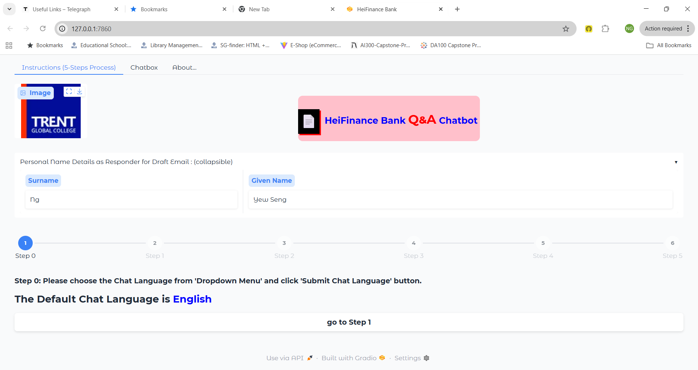
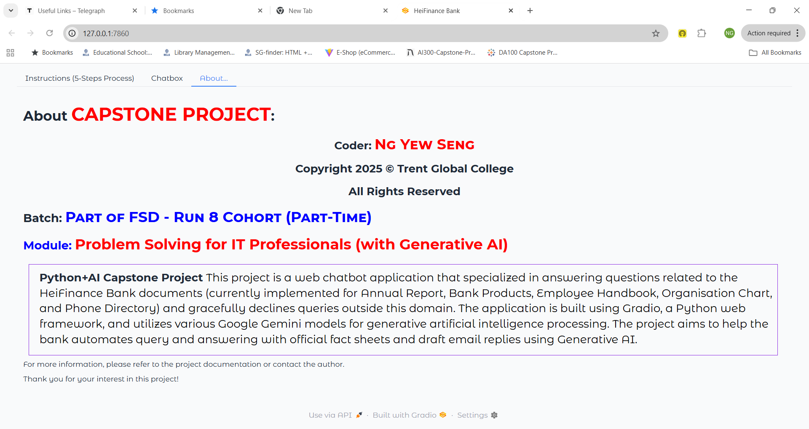

# TGC-CP1

## Codebase Author
**Ng Yew Seng**

<!-- .md means markdown -->

<!-- README.md -->
<!-- This file documents the information about the portfolio project. -->
<!-- It should be READ ME first!!! -->

---

## Live Web Application "HeiFinance Bank Q&A Chatbot"
**Website URL:**\
[**HeiFinance Bank:** Generative AI Tool](https://dc87f379f32f1bfecb.gradio.live)

Click the hyperlink <https://dc87f379f32f1bfecb.gradio.live> to start the live web application!

This share link expires in 1 week (dated 25 November 2025). For free permanent hosting and GPU upgrades, run `gradio deploy` from the terminal in the working directory to deploy to Hugging Face Spaces (https://huggingface.co/spaces)

---

<!-- Heading level 1 -->
# Trent Global College
**Problem Solving for IT Professionals (with Generative AI)**

FREE Course: **Python + AI**

By the end of the free course, the learner should be able to build a conversational chatbot that utilize Google's Gemini Language Model (LLM) and Gradio for an interactive user interface.

***Capstone Project Assignment - Portfolio***

The project consists of the following key components:

Part 1:\
**Environment Setup**: Using environment variables to securely store sensitive information like API Keys.

Part 2:\
**Integrating Gemini LLM**: Leveraging Google's Gemini LLM to generate intelligent responses.

Part 3:\
**Gradio Interface**: Creating an intuitive user interface for interacting with the chatbot.

Part 4:\
**Specialization**: Training the LLM, ensuring the chatbot sticks to its domain expertise.


<!-- Heading level 3 -->
### Project File Structure:

**TGC-CP1 Directory (Sources Root)**
```bash
TGC-CP1/   # Project Root
│── doc/
│   ├── Problem Solving for IT Professionals PP.docx.pdf  # Assessment 
│── img/
│   ├── heifinance-home.png  #
│   ├── heifinance-about.png  #
│   ├── heifinance-chatbot-pg1.png  # 
│   ├── heifinance-chatbot-pg2.png  #
│   ├── heifinance-chatbot-pg3.png  # 
│   ├── heifinance-step0.png  #
│   ├── heifinance-step1-chat-query.png  # 
│   ├── heifinance-step1-draft-email.png  #
│   ├── heifinance-step2.png  # 
│   ├── heifinance-step3-chat-query.png  #
│   ├── heifinance-step3-draft-email.png  # 
│   ├── heifinance-step3.png  # 
│   ├── heifinance-step4.png  #
│   ├── TG-LOGO-COLOR.png  # Trent Global logo (png format)
│   ├── TG-LOGO-COLOR.webp  # Trent Global logo (webp format -> original) 
│── res/
│   ├── TG-LOGO-COLOR.ico  # Trent Global logo (ico format) 
│── pdf-HeiFinance/
│   ├── Annual Report/
│   │   ├── HeiFinance_Annual_Report_2025.pdf  # Pdf format for annual report
│   ├── Bank Products/
│   │   ├── HeiFinance Bank Product Fact Sheet.pdf  # Pdf format for bank products
│   ├── Employee Handbook/
│   │   ├── HeiFinance_Employee_Handbook.pdf  # Pdf format for employee handbook
│   ├── Organisation Chart/
│   │   ├── HeiFinance_Organization_Chart_Executive_Summary.pdf  # Pdf format for organization chart (new)
│   ├── Phone Directory/
│   │   ├── HeiFinance_Full_Directory_Complete.pdf  # Pdf format for phone directory
│   │   ├── heifinance_tables-formatted.json  # In-used json format for phone dircetory
│   │   ├── hei_tables-formatted copy.json  # Copy of hei_tables.json but formatted
│── src/
│   ├── app.py  # Gradio App for HeiFinance Q&A Chatbot
│   ├── gemini_utils.py  # Gemini AI model helper functions
│── .gitignore  # Ignore for Git push
│── .env  # Environment variables for the project
├── extract_tables_robust.py  # Document Converter from PDF to JSON format
├── hei_tables.json  # Converted JSON file format (from HeiFinance_Full_Directory_Complete.pdf)
│── requirements.txt  # Dependencies for the project
│── instructions.md # Setup instructions
│── README.md  # Documentation for Capstone Project
│── run-gradio.sh  # Bash file to run the Gradio app
│── run-venv.sh  # Bash file to run virtual environment
│── setup-environment.sh  # Bash file for environment setup
```

<!-- Heading level 1 -->
# Project Guide
For the purpose of the portfolio project, a frontend Gradio application with Generative AI model is created for the following:

```json
{
1. "HeiFinance Generative AI Tool" : in our case "HeiFinance Bank Q&A Chatbot"
}
```

This project is about a simple *Generative AI Tool* at **HeiFinance Bank** using the concepts we learned in the Python + AI course as part of the module Problem Solving for IT Professionals (with Generative AI) for SCTP BELLS FSD - Run 8 Cohort (Part-Time).


This simple web software is a chatbot specializing in answering questions related to the HeiFinance documents (currently implemented for Annual Report, Bank Products, Employee Handbook, Organisation Chart, and Phone Directory) and gracefully declines queries outside this domain.

It provides components using Gradio interface for user inputs using chatbot queries in order to obtain answers using simple RAG system for selecting a PDF file format document and an pre-defined JSON file format. 



Screenshot of Home Page

")

Screenshot of Chatbot Page (1 of 3)

")

Screenshot of Chatbot Page (2 of 3)

")

Screenshot of Chatbot Page (3 of 3)

")

Screenshot of Chat Language section (Step 0)

")

Screenshot of Chat Category + Chat Query section (Step 1a)

")

Screenshot of Chat Category + Draft Email section (Step 1b)

")

Screenshot of Build Index section (Step 2)

")

Screenshot of HeiFinance Chatbox + Chat Query section (Step 3a)

")

Screenshot of HeiFinance Chatbox + Draft Email section (Step 3b)

")

Screenshot of Chatbox section (Step 4)



Screenshot of About Page


<!-- Heading level 4 -->
#### The url for the portfolio project is here:

It is not deployed.

<!-- Heading level 4 -->
#### The source codes is hosted as public on a GitHub repository and the link is as follows: 

- [Source Codes GitHub Link](https://github.com/ngys9919/tgc-cp1 "My source-codes!")
: Click the hyperlink <https://github.com/ngys9919/tgc-cp1>

<!-- Heading level 2 -->
## 💻 Running via localhost using [GitHub Code Repository][1]
If using Windows OS for local running via GitHub, follow these steps:

### **Clone GitHub Repository**

```bash
git clone https://github.com/ngys9919/tgc-cp1.git
cd TGC-CP1
```

### **Setup Virtual Environment**

```bash
C:\\ProgramData\\anaconda3\\python.exe -m venv venv
# On Windows (using Git Bash Terminal):
source venv/Scripts/activate
# On Windows (using Command Prompt): venv\Scripts\activate
# On MacOS and Linux: source venv/bin/activate
```

### **Install Project Dependencies**

```bash
pip install -r requirements.txt
```

### **Run Gradio Application**

```bash
python src/app.py
```

### **Open Web Browser**

Open your web browser, enter the following URL:
 
**http://127.0.0.1:7860**

to start the Gradio web app!

<!-- Heading level 2 -->
## Features
The Python Web Framework used is Gradio (light-weight, popular for Generative AI aplications) and the Gemini Models adopted for PDF RAG (because we need vector embedding and general generative ai models) are:

**EMBED_MODEL** = *"text-embedding-004"*

**GEN_MODEL** = *"gemini-2.5-flash-lite"*

and the Gemini Model adopted for JSON (because we need code execution capability for data analysis using Python and Pandas library) is:

**GEN_MODEL2** = *"gemini-2.5-flash"*

> Home page:
1. Instructions (5-Steps Process) tab - to startup landing page with instructions, which here aka Home page
2. Chatbot tab - to use HeiFinance Q&A Chatbot Tool
3. About tab - to display the credits information

> Chatbot page:

It begins with 5-steps process as follows:

**Step 0:** Please choose the Chat Language from 'Dropdown Menu' and click 'Submit Chat Language' button.

**Step 1:** Please choose the Chat Category from 'Radio' button and select your Output Type.

**Step 2:** Please click 'Build Index' button to start.

**Step 3:** Please type your query in the Textbox below.

**Step 4 (optional):** To clear conversations, click 'Clear HeiFinance Chatbox' button.

<h1 style='text-align: center; color: red; !important'>IMPORTANT NOTICE:</h1> <h2 style='text-align: center; color: blue; !important'>To clear error message, click 'Clear HeiFinance Chatbox OR Reset Error' button.</h2>

> About page:

To display the credits information such as coder, copyright, training provider and the capstone project itself.

<!-- Heading level 3 -->
### Existing Features
Current implementation is a proof-of-concept chatbot with a Gradio web interface using Retrieval-Augmented Generation (RAG) pipeline to provide accurate, context-aware answers from a custom knowledge base of pdf documents (in the use cases of Bank Products, Employee Handbook, etc.) and json table (in the use case of Phone Directory). However, for the use case of Annual Report, it is harder to do it since it contains texts, tables and may be images, this calls for Multi-Modal RAG (which is the current research topics). It ustilised AI models from Google AI Studio to enable the system to query specific documents and significantly reduce manual search efforts and less error-prone (although sometimes LLM does have a hallucination problem).


<!-- Heading level 3 -->
### Future Implementation
Future implementaion could include a full Multi-Modal RAG System (that takes in all sources of digital media) and a real full-stack web development using MERN tech stack (instead of relying on Gradio for quick prototyping). The embeddings could be moved to Vector Database like Pinecone (instead of need to Build Index every time in each restart of the web chatbot app). The chatbox history (now it is based on short-term memory) could be moved to persistent storage like (SQL or NoSQL Database) instead of loss every time it is restarted.


<!-- Heading level 2 -->
## Testing


## Testing A: Annual Report

> Select Chat Category -> Annual Report, which chooses HeiFinance_Annual_Report_2025.pdf

### Prompt Examples:

## Query 1: Could you comment on the company performance?

```markdown
HeiFinance Group demonstrated robust growth and strategic execution in the fiscal year [REDACTED], with a record Net Profit of SGD [REDACTED] billion, a significant [REDACTED]% increase from the previous year. This performance is attributed to operational excellence and prudent risk management. The company's success was driven by three key strategic pillars: Digital Transformation, Regional Connectivity, and Sustainable Finance. Their digital transformation efforts led to a [REDACTED]% increase in digitally active customers and a [REDACTED]% reduction in the cost-to-income ratio. Regional connectivity initiatives contributed to a [REDACTED]% rise in fee income from cross-border transactions. Furthermore, the issuance of their inaugural Green Bond, raising SGD [REDACTED] million, highlights their commitment to sustainable finance. The Group maintained a healthy balance sheet and robust capital adequacy, positioning them for continued expansion.
```

## Query 2: Who are in the board of directors?

```markdown
The board of directors consists of:

Mr. Lim Siong Guan (Chairman, Independent Non-Executive Director)
Mr. Kenji Tan (Group Chief Executive Officer, Executive Director)
Ms. Grace Chen (Lead Independent Director)
Dr. Ravi Menon (Independent Non-Executive Director)
Ms. Tan Hwee Ling (Independent Non-Executive Director)
Mr. Michael Wong (Non-Executive Director)
```

## Query 3: What are the key financial highlights for the year 2025?

```markdown
I don't know.
```

## Testing B: Bank Products

> Select Chat Category -> Bank Products, which chooses HeiFinance Bank Product Fact Sheet.pdf

### Prompt Examples:

## Query 1: What is the minimum deposit for heifinance saving plus account?

```markdown
The minimum deposit requirement for the HeiFinance SavingsPlus Account is SGD 500.
```

## Query 2: Hi, can you tell me what the minimum deposit is for the heifinance savingsplus account and whether i can get bonus interest if i only spend $400 monthly on my credit card?

```markdown
The minimum deposit requirement for the HeiFinance SavingsPlus Account is SGD 500.

To receive bonus interest for eligible debit or credit card spending, a minimum of SGD 500 needs to be spent monthly. Therefore, if you only spend $400 monthly on your credit card, you would not qualify for this specific bonus interest component.
```

## Query 3: How much cashback on the visa platinum card can i get if i spend 1000 on groceries, 800 on dining and 900 on online purchases?

```markdown
To calculate the cashback, we need to break down the spending according to the card's rewards program.

Groceries and Dining: These categories earn 3% cashback.
Total spent on groceries and dining = SGD 1000 + SGD 800 = SGD 1800
Cashback on groceries and dining = 3% of SGD 1800 = SGD 54
Online Purchases: These fall under "all other retail transactions" and earn 1% cashback.
Cashback on online purchases = 1% of SGD 900 = SGD 9
Total Cashback: SGD 54 + SGD 9 = SGD 63
The monthly cashback cap is SGD 80. Since SGD 63 is below this cap, the total cashback earned is SGD 63.
```

## Query 4: What is the difference between floating and fixed loan rate offered by heifinance?

```markdown
The HeiFinance HomeFlex Loan offers two packages: a Fixed Rate Package and a Floating Rate Package.

Fixed Rate Package:

The interest rate is fixed for the first 3 years.
After this fixed period, the rate reverts to the HeiFinance Board Rate (currently 3.5% p.a.) minus a customer discount.
This package provides certainty in monthly installments, making it suitable for customers who prefer predictability.

Floating Rate Package:

The interest rate is pegged to 3M SORA plus a spread ranging between 0.80% and 1.20%.
The rates reset quarterly according to SORA movement.
This package is suitable for customers who are comfortable with fluctuations in the hope of potentially lower costs.
```

## Query 5: If i refinance my existing mortgage, what is my estimated monthly repayment under the homeflex loan floating package?

```markdown
I don't know. The provided context does not contain information about the estimated monthly repayment for refinancing an existing mortgage under the HomeFlex Loan floating package. It does mention that the Floating Rate Package is pegged to 3M SORA plus a spread ranging between 0.80% and 1.20%, and rates reset quarterly [Source 1, Source 2]. There is also a refinancing subsidy of up to SGD 2,000 for legal and valuation fees for refinancing customers.
```

## Testing C: Employee Handbook

> Select Chat Category -> Employee Handbook, which chooses HeiFinance_Employee_Handbook.pdf

### Prompt Examples:

## Query 1: Can you summarize the content of the uploaded PDF?

```markdown
The provided PDF is the HeiFinance Employee Handbook. It outlines terms and conditions of employment, policies, procedures, and standards of conduct. It clarifies that the handbook is a guide and not an employment contract, with the Letter of Appointment or Singapore Employment Act prevailing in case of conflicts. The handbook also covers probationary periods, termination of service and resignation, involuntary termination/dismissal, appointment procedures including pre-employment checks and work pass requirements, and company rights regarding job assignments. It also touches upon policies concerning non-competition and the usage of internet and electronic mail. The management reserves the right to revise these policies.
```

## Query 2: What are the key points discussed in the document?

```markdown
The document discusses the introduction to the HeiFinance Employee Handbook, including its purpose and disclaimers. It also covers terms of employment such as probationary periods and termination of service, including notice periods and resignation procedures. Additionally, it addresses policies on non-competition, internet and electronic mail usage, and non-disclosure of information. The handbook also mentions a whistle-blowing program.
```

## Query 3: Can you explain the main arguments presented in the PDF?

```markdown
I don't know.
```

## Query 4: What is the working hours?

```markdown
The standard working week for all non-shift employees is 40 hours over 5 working days, Monday to Friday. General office hours are 9:00 AM to 6:00 PM with a 1-hour lunch break. The lunch break is from 1:00 PM to 2:00 PM. Specific departments, particularly those in front-office, trading, or operations roles, may have different working hours or shift arrangements, which will be specified in the Letter of Appointment or departmental guidelines.
```

## Query 5: What is the procedure for handling complaints?

```markdown
I don't know.
```

## Query 6: What is the company's policy on outside employment?

```markdown
Employees are expected to dedicate their full working time and attention to the company. They are not allowed to take on outside employment, business, or professional activities that could create a conflict of interest or hinder their ability to perform their duties effectively. Any outside employment must be declared to and approved in writing by the Head of Human Resources and the Department Head. This approval can be revoked at any time.
```

## Testing D: Organisation Chart

> Select Chat Category -> Organisation Chart, which chooses HeiFinance_Organization_Chart_Executive_Summary.pdf

### Prompt Examples:

## Query 1: Who is the CEO and CFO?

```markdown
The CEO is Kenji Tan and the CFO is Li Wei.
```

## Query 2: How many country heads are there and who are they?

```markdown
There are six country heads: Lim Hock Chuan (Singapore), Jing Li (China), William Chan (Hong Kong), Siti Nurhaliza (Malaysia), Somchai Boonruang (Thailand), and Budi Santoso (Indonesia).
```

## Testing E: Phone Directory

> Select Chat Category -> Phone Directory, which chooses HeiFinance_Full_Directory_Complete.pdf -> heifinance_tables-formatted.json

### Basic Information:

Length of All Employees Names: 128\
Length of Unique Names: 122\
Total number of employees from Singapore: 74\
Length of Repeated Names (in Singaopore employees): 6

Repeated Names (in Singapore employees):

['Linda Tan', 'Marcus Sharma', 'James Poh', 'Sarah Wong', 'Chloe Ooi', 'Rajeev Lim']

### Prompt Examples:

## Query 1: Please retrieve the details for CFO and the names for staff working in Singapore. Count the number of Singapore staff.

```markdown
Here are the details you requested:

CFO Details:

EmployeeID: 2
Name: Li Wei
Job Title: Chief Financial Officer
Department: Finance
Contact: +65 6789-0002
Email: li.wei@heifinance.com
Office Location: Marina Bay Tower
Country: Singapore
Names of Staff Working in Singapore:

* Kenji Tan
* Li Wei
* David Lim
* Priya Sharma
* Ahmad Razak
* Michael Chen
* Sarah Wong
* Rajeev Singh
* Chloe Ng
* Jason Lee
* Evelyn Goh
* Lim Hock Chuan
* Kenji Ng
* Rajeev Razak
* Linda Lim
* David Wong
* James Poh
* Linda Wong
* Michael Seah
* Evelyn Sharma
* Marcus Sharma
* Li Chua
* Linda Lee
* David Wei
* Jason Lim
* Priya Teo
* Robert Hock
* Lim Hock
* Chloe Lim
* Michael Chua
* Evelyn Wei
* Li Goh
* Christopher Goh
* Patricia Teo
* Rajeev Yap
* Priya Razak
* Jennifer Poh
* Marcus Teo
* Linda Tan
* Linda Ng
* Chloe Ooi
* James Sharma
* James Poh Ah Kow
* Ahmad Hock
* Linda Ooi
* Barbara Goh
* Rajeev Ong
* David Koh
* Linda Razak
* Patricia Yap
* Chloe Ooi Ah Miow
* Rajeev Lim
* Kenji Lim
* Rajeev Lim Ah Choo
* Evelyn Lim
* Christopher Ong
* Jennifer Hock
* Priya Wei
* Sarah Wong Ah Tu
* Linda Tan Ah Sir
* Rajeev Chen
* Marcus Wei
* Marcus Tan
* Jennifer Yap
* Sarah Wei
* Barbara Lim
* Marcus Sharma Ah
* Jennifer Ong
* Sarah Goh
* Chloe Teo
* Jason Chua
* David Yap
* James Ng
* Lim Lim

Total Number of Staff Working in Singapore: 74
```

## Query 2: Could you count the number of total employees in the phone directory? Show how you do the calculation.

```markdown
### The total number of employees in the phone directory is 128. This was calculated by counting the number of entries in the provided employee data.
```

## Query 3: Who is working in Beijing Office?

```markdown
### There are 9 employees working in the Beijing office. Their names are: Jing Li, Qiang Chen, Ling Tang, Yan Chen, Ming Zhou, Hui Zhao, Jing Zheng, Wei Wang, and Fang Li.
```

## Query 4: List out all employees with key-value pairs "Country": "Singapore". Count the length of such key-value pairs cases. 

```markdown
### The employees with 'Country': 'Singapore' are as follows:

```json
{'EmployeeID': 1, 'Name': 'Kenji Tan', 'Job Title': 'Group Chief Executive Officer', 'Department': 'Executive Leadership', 'Contact': '+65 6789-0001', 'Email': 'kenji.tan@heifinance.com', 'Office Location': 'Marina Bay Tower', 'Country': 'Singapore'}
{'EmployeeID': 2, 'Name': 'Li Wei', 'Job Title': 'Chief Financial Officer', 'Department': 'Finance', 'Contact': '+65 6789-0002', 'Email': 'li.wei@heifinance.com', 'Office Location': 'Marina Bay Tower', 'Country': 'Singapore'}
{'EmployeeID': 3, 'Name': 'David Lim', 'Job Title': 'Chief Operating Officer', 'Department': 'Operations', 'Contact': '+65 6789-0003', 'Email': 'david.lim@heifinance.com', 'Office Location': 'Marina Bay Tower', 'Country': 'Singapore'}
{'EmployeeID': 4, 'Name': 'Priya Sharma', 'Job Title': 'Chief Information Officer', 'Department': 'Technology', 'Contact': '+65 6789-0004', 'Email': 'priya.sharma@heifinance.com', 'Office Location': 'Marina Bay Tower', 'Country': 'Singapore'}
{'EmployeeID': 5, 'Name': 'Ahmad Razak', 'Job Title': 'Chief Risk Officer', 'Department': 'Risk Management', 'Contact': '+65 6789-0005', 'Email': 'ahmad.razak@heifinance.com', 'Office Location': 'Marina Bay Tower', 'Country': 'Singapore'}
{'EmployeeID': 6, 'Name': 'Michael Chen', 'Job Title': 'Head of Institutional Banking', 'Department': 'Institutional Banking', 'Contact': '+65 6789-0006', 'Email': 'michael.chen@heifinance.com', 'Office Location': 'Marina Bay Tower', 'Country': 'Singapore'}
{'EmployeeID': 7, 'Name': 'Sarah Wong', 'Job Title': 'Head of Consumer Banking & Wealth Management', 'Department': 'Consumer Banking', 'Contact': '+65 6789-0007', 'Email': 'sarah.wong@heifinance.com', 'Office Location': 'Marina Bay Tower', 'Country': 'Singapore'}
{'EmployeeID': 8, 'Name': 'Rajeev Singh', 'Job Title': 'Head of Global Financial Markets', 'Department': 'Global Financial Markets', 'Contact': '+65 6789-0008', 'Email': 'rajeev.singh@heifinance.com', 'Office Location': 'Marina Bay Tower', 'Country': 'Singapore'}
{'EmployeeID': 9, 'Name': 'Chloe Ng', 'Job Title': 'Head of Strategic Marketing & Communications', 'Department': 'Marketing', 'Contact': '+65 6789-0009', 'Email': 'chloe.ng@heifinance.com', 'Office Location': 'Marina Bay Tower', 'Country': 'Singapore'}
{'EmployeeID': 10, 'Name': 'Jason Lee', 'Job Title': 'Head of Human Resources', 'Department': 'Human Resources', 'Contact': '+65 6789-0010', 'Email': 'jason.lee@heifinance.com', 'Office Location': 'Marina Bay Tower', 'Country': 'Singapore'}
{'EmployeeID': 11, 'Name': 'Evelyn Goh', 'Job Title': 'Head of Legal & Compliance', 'Department': 'Legal', 'Contact': '+65 6789-0011', 'Email': 'evelyn.goh@heifinance.com', 'Office Location': 'Marina Bay Tower', 'Country': 'Singapore'}
{'EmployeeID': 12, 'Name': 'Lim Hock Chuan', 'Job Title': 'Country Head - Singapore', 'Department': 'Regional Management', 'Contact': '+65 6789-1001', 'Email': 'lim.hockchuang@heifinance.com', 'Office Location': 'Marina Bay Tower', 'Country': 'Singapore'}
{'EmployeeID': 18, 'Name': 'Kenji Ng', 'Job Title': 'Senior Relationship Manager - Corporate Banking', 'Department': 'Institutional Banking', 'Contact': '+65-6789-0100', 'Email': 'kenji.ng@heifinance.com', 'Office Location': 'Marina Bay Tower', 'Country': 'Singapore'}
{'EmployeeID': 19, 'Name': 'Rajeev Razak', 'Job Title': 'Senior Relationship Manager - Corporate Banking', 'Department': 'Institutional Banking', 'Contact': '+65-6789-0101', 'Email': 'rajeev.razak@heifinance.com', 'Office Location': 'Marina Bay Tower', 'Country': 'Singapore'}
{'EmployeeID': 20, 'Name': 'Linda Lim', 'Job Title': 'Relationship Manager - Corporate Banking', 'Department': 'Institutional Banking', 'Contact': '+65-6789-0102', 'Email': 'linda.lim@heifinance.com', 'Office Location': 'Marina Bay Tower', 'Country': 'Singapore'}
{'EmployeeID': 22, 'Name': 'David Wong', 'Job Title': 'Relationship Manager - Corporate Banking', 'Department': 'Institutional Banking', 'Contact': '+65-6789-0104', 'Email': 'david.wong@heifinance.com', 'Office Location': 'Marina Bay Tower', 'Country': 'Singapore'}
{'EmployeeID': 23, 'Name': 'James Poh', 'Job Title': 'Credit Analyst - Corporate Banking', 'Department': 'Institutional Banking', 'Contact': '+65-6789-0105', 'Email': 'james.poh@heifinance.com', 'Office Location': 'Marina Bay Tower', 'Country': 'Singapore'}
{'EmployeeID': 24, 'Name': 'Linda Wong', 'Job Title': 'Credit Analyst - Corporate Banking', 'Department': 'Institutional Banking', 'Contact': '+65-6789-0106', 'Email': 'linda.wong@heifinance.com', 'Office Location': 'Marina Bay Tower', 'Country': 'Singapore'}
{'EmployeeID': 27, 'Name': 'Michael Seah', 'Job Title': 'Transaction Manager - Transaction Banking', 'Department': 'Institutional Banking', 'Contact': '+65-6789-0109', 'Email': 'michael.seah@heifinance.com', 'Office Location': 'Marina Bay Tower', 'Country': 'Singapore'}
{'EmployeeID': 29, 'Name': 'Evelyn Sharma', 'Job Title': 'Payment Operations Specialist - Transaction Banking', 'Department': 'Institutional Banking', 'Contact': '+65-6789-0111', 'Email': 'evelyn.sharma@heifinance.com', 'Office Location': 'Marina Bay Tower', 'Country': 'Singapore'}
{'EmployeeID': 30, 'Name': 'Marcus Sharma', 'Job Title': 'Branch Manager - Retail Banking', 'Department': 'Retail Banking', 'Contact': '+65-6789-0112', 'Email': 'marcus.sharma@heifinance.com', 'Office Location': 'Marina Bay Tower', 'Country': 'Singapore'}
{'EmployeeID': 32, 'Name': 'Li Chua', 'Job Title': 'Relationship Manager - Retail Banking', 'Department': 'Retail Banking', 'Contact': '+65-6789-0114', 'Email': 'li.chua@heifinance.com', 'Office Location': 'Marina Bay Tower', 'Country': 'Singapore'}
{'EmployeeID': 34, 'Name': 'Linda Lee', 'Job Title': 'Relationship Manager - Retail Banking', 'Department': 'Retail Banking', 'Contact': '+65-6789-0116', 'Email': 'linda.lee@heifinance.com', 'Office Location': 'Marina Bay Tower', 'Country': 'Singapore'}
{'EmployeeID': 36, 'Name': 'David Wei', 'Job Title': 'Customer Service Officer - Retail Banking', 'Department': 'Retail Banking', 'Contact': '+65-6789-0118', 'Email': 'david.wei@heifinance.com', 'Office Location': 'Marina Bay Tower', 'Country': 'Singapore'}
{'EmployeeID': 37, 'Name': 'Jason Lim', 'Job Title': 'Loan Officer - Retail Banking', 'Department': 'Retail Banking', 'Contact': '+65-6789-0119', 'Email': 'jason.lim@heifinance.com', 'Office Location': 'Marina Bay Tower', 'Country': 'Singapore'}
{'EmployeeID': 38, 'Name': 'Priya Teo', 'Job Title': 'Loan Officer - Retail Banking', 'Department': 'Retail Banking', 'Contact': '+65-6789-0120', 'Email': 'priya.teo@heifinance.com', 'Office Location': 'Marina Bay Tower', 'Country': 'Singapore'}
{'EmployeeID': 39, 'Name': 'Robert Hock', 'Job Title': 'Private Banker - Private Banking', 'Department': 'Private Banking', 'Contact': '+65-6789-0121', 'Email': 'robert.hock@heifinance.com', 'Office Location': 'Marina Bay Tower', 'Country': 'Singapore'}
{'EmployeeID': 40, 'Name': 'Lim Hock', 'Job Title': 'Private Banker - Private Banking', 'Department': 'Private Banking', 'Contact': '+65-6789-0122', 'Email': 'lim.hock@heifinance.com', 'Office Location': 'Marina Bay Tower', 'Country': 'Singapore'}
{'EmployeeID': 41, 'Name': 'Chloe Lim', 'Job Title': 'Wealth Manager - Private Banking', 'Department': 'Private Banking', 'Contact': '+65-6789-0123', 'Email': 'chloe.lim@heifinance.com', 'Office Location': 'Marina Bay Tower', 'Country': 'Singapore'}
{'EmployeeID': 43, 'Name': 'Michael Chua', 'Job Title': 'Investment Advisor - Private Banking', 'Department': 'Private Banking', 'Contact': '+65-6789-0125', 'Email': 'michael.chua@heifinance.com', 'Office Location': 'Marina Bay Tower', 'Country': 'Singapore'}
{'EmployeeID': 45, 'Name': 'Evelyn Wei', 'Job Title': 'Product Manager - Digital Banking', 'Department': 'Digital Banking', 'Contact': '+65-6789-0127', 'Email': 'evelyn.wei@heifinance.com', 'Office Location': 'Marina Bay Tower', 'Country': 'Singapore'}
{'EmployeeID': 46, 'Name': 'Li Goh', 'Job Title': 'Systems Analyst - Digital Banking', 'Department': 'Digital Banking', 'Contact': '+65-6789-0128', 'Email': 'li.goh@heifinance.com', 'Office Location': 'Marina Bay Tower', 'Country': 'Singapore'}
{'EmployeeID': 48, 'Name': 'Christopher Goh', 'Job Title': 'Trader - Trading', 'Department': 'Trading', 'Contact': '+65-6789-0130', 'Email': 'christopher.goh@heifinance.com', 'Office Location': 'Marina Bay Tower', 'Country': 'Singapore'}
{'EmployeeID': 49, 'Name': 'Patricia Teo', 'Job Title': 'Trader - Trading', 'Department': 'Trading', 'Contact': '+65-6789-0131', 'Email': 'patricia.teo@heifinance.com', 'Office Location': 'Marina Bay Tower', 'Country': 'Singapore'}
{'EmployeeID': 51, 'Name': 'Rajeev Yap', 'Job Title': 'Trading Analyst - Trading', 'Department': 'Trading', 'Contact': '+65-6789-0133', 'Email': 'rajeev.yap@heifinance.com', 'Office Location': 'Marina Bay Tower', 'Country': 'Singapore'}
{'EmployeeID': 56, 'Name': 'Priya Razak', 'Job Title': 'Analyst - Capital Markets', 'Department': 'Capital Markets', 'Contact': '+65-6789-0138', 'Email': 'priya.razak@heifinance.com', 'Office Location': 'Marina Bay Tower', 'Country': 'Singapore'}
{'EmployeeID': 57, 'Name': 'Jennifer Poh', 'Job Title': 'Senior Treasurer - Treasury', 'Department': 'Treasury', 'Contact': '+65-6789-0139', 'Email': 'jennifer.poh@heifinance.com', 'Office Location': 'Marina Bay Tower', 'Country': 'Singapore'}
{'EmployeeID': 58, 'Name': 'Marcus Teo', 'Job Title': 'Treasurer - Treasury', 'Department': 'Treasury', 'Contact': '+65-6789-0140', 'Email': 'marcus.teo@heifinance.com', 'Office Location': 'Marina Bay Tower', 'Country': 'Singapore'}
{'EmployeeID': 60, 'Name': 'Linda Tan', 'Job Title': 'Financial Planner - Financial Planning', 'Department': 'Financial Planning', 'Contact': '+65-6789-0142', 'Email': 'linda.tan@heifinance.com', 'Office Location': 'Marina Bay Tower', 'Country': 'Singapore'}
{'EmployeeID': 61, 'Name': 'Linda Ng', 'Job Title': 'Financial Planner - Financial Planning', 'Department': 'Financial Planning', 'Contact': '+65-6789-0143', 'Email': 'linda.ng@heifinance.com', 'Office Location': 'Marina Bay Tower', 'Country': 'Singapore'}
{'EmployeeID': 64, 'Name': 'Chloe Ooi', 'Job Title': 'Accountant - Financial Planning', 'Department': 'Financial Planning', 'Contact': '+65-6789-0146', 'Email': 'chloe.ooi@heifinance.com', 'Office Location': 'Marina Bay Tower', 'Country': 'Singapore'}
{'EmployeeID': 65, 'Name': 'James Sharma', 'Job Title': 'Treasurer - Treasury', 'Department': 'Treasury', 'Contact': '+65-6789-0147', 'Email': 'james.sharma@heifinance.com', 'Office Location': 'Marina Bay Tower', 'Country': 'Singapore'}
{'EmployeeID': 66, 'Name': 'James Poh Ah Kow', 'Job Title': 'Cash Manager - Treasury', 'Department': 'Treasury', 'Contact': '+65-6789-0148', 'Email': 'james.poh2@heifinance.com', 'Office Location': 'Marina Bay Tower', 'Country': 'Singapore'}
{'EmployeeID': 67, 'Name': 'Ahmad Hock', 'Job Title': 'Investment Officer - Treasury', 'Department': 'Treasury', 'Contact': '+65-6789-0149', 'Email': 'ahmad.hock@heifinance.com', 'Office Location': 'Marina Bay Tower', 'Country': 'Singapore'}
{'EmployeeID': 68, 'Name': 'Linda Ooi', 'Job Title': 'Senior Accountant - Accounting', 'Department': 'Accounting', 'Contact': '+65-6789-0150', 'Email': 'linda.ooi@heifinance.com', 'Office Location': 'Marina Bay Tower', 'Country': 'Singapore'}
{'EmployeeID': 69, 'Name': 'Barbara Goh', 'Job Title': 'Senior Accountant - Accounting', 'Department': 'Accounting', 'Contact': '+65-6789-0151', 'Email': 'barbara.goh@heifinance.com', 'Office Location': 'Marina Bay Tower', 'Country': 'Singapore'}
{'EmployeeID': 72, 'Name': 'Rajeev Ong', 'Job Title': 'Process Manager - Process Management', 'Department': 'Process Management', 'Contact': '+65-6789-0154', 'Email': 'rajeev.ong@heifinance.com', 'Office Location': 'Marina Bay Tower', 'Country': 'Singapore'}
{'EmployeeID': 73, 'Name': 'David Koh', 'Job Title': 'Operations Analyst - Process Management', 'Department': 'Process Management', 'Contact': '+65-6789-0155', 'Email': 'david.koh@heifinance.com', 'Office Location': 'Marina Bay Tower', 'Country': 'Singapore'}
{'EmployeeID': 74, 'Name': 'Linda Razak', 'Job Title': 'Operations Analyst - Process Management', 'Department': 'Process Management', 'Contact': '+65-6789-0156', 'Email': 'linda.razak@heifinance.com', 'Office Location': 'Marina Bay Tower', 'Country': 'Singapore'}
{'EmployeeID': 75, 'Name': 'Patricia Yap', 'Job Title': 'Quality Officer - Process Management', 'Department': 'Process Management', 'Contact': '+65-6789-0157', 'Email': 'patricia.yap@heifinance.com', 'Office Location': 'Marina Bay Tower', 'Country': 'Singapore'}
{'EmployeeID': 76, 'Name': 'Chloe Ooi Ah Miow', 'Job Title': 'Service Manager - Service Delivery', 'Department': 'Service Delivery', 'Contact': '+65-6789-0158', 'Email': 'chloe.ooi2@heifinance.com', 'Office Location': 'Marina Bay Tower', 'Country': 'Singapore'}
{'EmployeeID': 81, 'Name': 'Rajeev Lim', 'Job Title': 'Facilities Officer - Facilities', 'Department': 'Facilities Management', 'Contact': '+65-6789-0163', 'Email': 'rajeev.lim@heifinance.com', 'Office Location': 'Marina Bay Tower', 'Country': 'Singapore'}
{'EmployeeID': 84, 'Name': 'Kenji Lim', 'Job Title': 'Systems Administrator - Infrastructure', 'Department': 'Infrastructure', 'Contact': '+65-6789-0166', 'Email': 'kenji.lim@heifinance.com', 'Office Location': 'Marina Bay Tower', 'Country': 'Singapore'}
{'EmployeeID': 85, 'Name': 'Rajeev Lim Ah Choo', 'Job Title': 'Network Engineer - Infrastructure', 'Department': 'Infrastructure', 'Contact': '+65-6789-0167', 'Email': 'rajeev.lim2@heifinance.com', 'Office Location': 'Marina Bay Tower', 'Country': 'Singapore'}
{'EmployeeID': 86, 'Name': 'Evelyn Lim', 'Job Title': 'Application Manager - Applications', 'Department': 'Applications', 'Contact': '+65-6789-0168', 'Email': 'evelyn.lim@heifinance.com', 'Office Location': 'Marina Bay Tower', 'Country': 'Singapore'}
{'EmployeeID': 89, 'Name': 'Christopher Ong', 'Job Title': 'Systems Analyst - Applications', 'Department': 'Applications', 'Contact': '+65-6789-0171', 'Email': 'christopher.ong@heifinance.com', 'Office Location': 'Marina Bay Tower', 'Country': 'Singapore'}
{'EmployeeID': 92, 'Name': 'Jennifer Hock', 'Job Title': 'Compliance Officer - Security', 'Department': 'Security', 'Contact': '+65-6789-0174', 'Email': 'jennifer.hock@heifinance.com', 'Office Location': 'Marina Bay Tower', 'Country': 'Singapore'}
{'EmployeeID': 94, 'Name': 'Priya Wei', 'Job Title': 'Risk Analyst - Credit Risk', 'Department': 'Credit Risk', 'Contact': '+65-6789-0176', 'Email': 'priya.wei@heifinance.com', 'Office Location': 'Marina Bay Tower', 'Country': 'Singapore'}
{'EmployeeID': 96, 'Name': 'Sarah Wong Ah Tu', 'Job Title': 'Credit Officer - Credit Risk', 'Department': 'Credit Risk', 'Contact': '+65-6789-0178', 'Email': 'sarah.wong2@heifinance.com', 'Office Location': 'Marina Bay Tower', 'Country': 'Singapore'}
{'EmployeeID': 101, 'Name': 'Linda Tan Ah Sir', 'Job Title': 'Risk Officer - Operational Risk', 'Department': 'Operational Risk', 'Contact': '+65-6789-0183', 'Email': 'linda.tan2@heifinance.com', 'Office Location': 'Marina Bay Tower', 'Country': 'Singapore'}
{'EmployeeID': 102, 'Name': 'Rajeev Chen', 'Job Title': 'Recruitment Manager - Recruitment', 'Department': 'Recruitment', 'Contact': '+65-6789-0184', 'Email': 'rajeev.chen@heifinance.com', 'Office Location': 'Marina Bay Tower', 'Country': 'Singapore'}
{'EmployeeID': 104, 'Name': 'Marcus Wei', 'Job Title': 'Recruiter - Recruitment', 'Department': 'Recruitment', 'Contact': '+65-6789-0186', 'Email': 'marcus.wei@heifinance.com', 'Office Location': 'Marina Bay Tower', 'Country': 'Singapore'}
{'EmployeeID': 105, 'Name': 'Marcus Tan', 'Job Title': 'HR Coordinator - Recruitment', 'Department': 'Recruitment', 'Contact': '+65-6789-0187', 'Email': 'marcus.tan@heifinance.com', 'Office Location': 'Marina Bay Tower', 'Country': 'Singapore'}
{'EmployeeID': 107, 'Name': 'Jennifer Yap', 'Job Title': 'Training Specialist - Learning & Development', 'Department': 'Learning & Development', 'Contact': '+65-6789-0189', 'Email': 'jennifer.yap@heifinance.com', 'Office Location': 'Marina Bay Tower', 'Country': 'Singapore'}
{'EmployeeID': 109, 'Name': 'Sarah Wei', 'Job Title': 'ER Manager - Employee Relations', 'Department': 'Employee Relations', 'Contact': '+65-6789-0191', 'Email': 'sarah.wei@heifinance.com', 'Office Location': 'Marina Bay Tower', 'Country': 'Singapore'}
{'EmployeeID': 115, 'Name': 'Barbara Lim', 'Job Title': 'Compliance Officer - Compliance', 'Department': 'Compliance', 'Contact': '+65-6789-0197', 'Email': 'barbara.lim@heifinance.com', 'Office Location': 'Marina Bay Tower', 'Country': 'Singapore'}
{'EmployeeID': 116, 'Name': 'Marcus Sharma Ah', 'Job Title': 'Compliance Officer - Compliance', 'Department': 'Compliance', 'Contact': '+65-6789-0198', 'Email': 'marcus.sharma2@heifinance.com', 'Office Location': 'Marina Bay Tower', 'Country': 'Singapore'}
{'EmployeeID': 119, 'Name': 'Jennifer Ong', 'Job Title': 'Regulatory Officer - Regulatory', 'Department': 'Regulatory', 'Contact': '+65-6789-0201', 'Email': 'jennifer.ong@heifinance.com', 'Office Location': 'Marina Bay Tower', 'Country': 'Singapore'}
{'EmployeeID': 121, 'Name': 'Sarah Goh', 'Job Title': 'Marketing Executive - Marketing', 'Department': 'Marketing', 'Contact': '+65-6789-0203', 'Email': 'sarah.goh@heifinance.com', 'Office Location': 'Marina Bay Tower', 'Country': 'Singapore'}
{'EmployeeID': 122, 'Name': 'Chloe Teo', 'Job Title': 'Marketing Executive - Marketing', 'Department': 'Marketing', 'Contact': '+65-6789-0204', 'Email': 'chloe.teo@heifinance.com', 'Office Location': 'Marina Bay Tower', 'Country': 'Singapore'}
{'EmployeeID': 123, 'Name': 'Jason Chua', 'Job Title': 'Digital Marketing Specialist - Marketing', 'Department': 'Marketing', 'Contact': '+65-6789-0205', 'Email': 'jason.chua@heifinance.com', 'Office Location': 'Marina Bay Tower', 'Country': 'Singapore'}
{'EmployeeID': 126, 'Name': 'David Yap', 'Job Title': 'PR Specialist - Communications', 'Department': 'Communications', 'Contact': '+65-6789-0208', 'Email': 'david.yap@heifinance.com', 'Office Location': 'Marina Bay Tower', 'Country': 'Singapore'}
{'EmployeeID': 127, 'Name': 'James Ng', 'Job Title': 'CX Manager - Customer Experience', 'Department': 'Customer Experience', 'Contact': '+65-6789-0209', 'Email': 'james.ng@heifinance.com', 'Office Location': 'Marina Bay Tower', 'Country': 'Singapore'}
{'EmployeeID': 128, 'Name': 'Lim Lim', 'Job Title': 'CX Specialist - Customer Experience', 'Department': 'Customer Experience', 'Contact': '+65-6789-0210', 'Email': 'lim.lim@heifinance.com', 'Office Location': 'Marina Bay Tower', 'Country': 'Singapore'}

The count of employees with 'Country': 'Singapore' is 74.
```

## Testing: Draft Email

> Select Chat Category -> Bank Products, which chooses HeiFinance Bank Product Fact Sheet.pdf

> Select Output Type -> Draft Email, which uses Personal Name Details as Responder for Draft Email

### Prompt Examples:

## Query 1:

```markdown
What is the minimum deposit for SavingsPlus?

Best regards,
Eric Andrew.
```

### Draft Email 1:

```markdown
Dear Eric Andrew,

Thank you for reaching out to HeiFinance Bank.

The minimum initial deposit requirement for the HeiFinance SavingsPlus Account is SGD 500.

For your reference:
• Base Interest: 0.05% p.a.
• Bonus Interest: Up to 2.00% p.a.
• Balance Maintenance: SGD 5 fee if average daily balance is below SGD 1,000.

If you have any further questions, please do not hesitate to contact us at cust.service@heifinance.com

Warm regards,
Ng Yew Seng
Customer Service Officer
HeiFinance Bank
```

## Query 2:

```markdown
If I refinance my existing mortgage, what is my estimated monthly repayment under the HomeFlex Loan floating package?

Best regards,
Eric Andrew.
```

### Draft Email 2:

```markdown
Dear Eric Andrew,

Thank you for reaching out to HeiFinance Bank.

To estimate your monthly repayment for refinancing under the HomeFlex Loan floating package, we need to know the loan amount and the specific spread applicable to your profile. The floating rate is pegged to 3M SORA plus a spread ranging between 0.80% and 1.20%. Rates reset quarterly.

For your reference:
• The loan-to-value limit is up to 75% for a first housing loan, and 55% if you have existing housing loans.
• The tenure is up to 30 years or until you reach 65 years old, whichever is earlier.
• A refinancing subsidy of up to SGD 2,000 for legal and valuation fees is available.

If you have any further questions, please do not hesitate to contact us at cust.service@heifinance.com

Warm regards,

Ng Yew Seng
Customer Service Officer
HeiFinance Bank
```

## Query 3:

```markdown
Hi, can you tell me what the minimum deposit is for the HeiFinance SavingsPlus Account, and whether I can get bonus interest if I only spend $400 monthly on my credit card?

Yours sincerely,
Eric Andrew.
```

### Draft Email 3:

```markdown
Dear Eric Andrew,

Thank you for reaching out to HeiFinance Bank.

The minimum deposit requirement for the HeiFinance SavingsPlus Account is SGD 500. Regarding bonus interest, you would need to meet specific criteria. To earn the 0.75% bonus interest for eligible debit or credit card spending, the monthly spend needs to be at least SGD 500. Spending SGD 400 monthly on your credit card would not qualify for this particular bonus tier.

For your reference:
• Minimum initial deposit: SGD 500
• Bonus interest requires salary credit of at least SGD 2,000 OR eligible card spending of at least SGD 500 OR 3 recurring bill payments.
• Base interest is 0.05% p.a.

If you have any further questions, please do not hesitate to contact us at cust.service@heifinance.com

Warm regards,
Ng Yew Seng
Customer Service Officer
HeiFinance Bank
```

## Query 4:

```markdown
Dear CSO,

How much cashback on the visa platinum card can i get if i spend 1000 on groceries, 800 on dining and 900 on online purchases?

Yours sincerely,
Irene
```

### Draft Email 4:

```markdown
Dear Irene,

Thank you for reaching out to HeiFinance Bank.

For the HeiFinance Visa Platinum Credit Card, you can earn 3% cashback on dining and supermarket spend. For other retail purchases like online purchases, you will receive 1% cashback.
With your spend of SGD 1,000 on groceries and SGD 800 on dining, you'll earn 3% on SGD 1,800, which is SGD 54. On your SGD 900 online purchases, you'll earn 1%, totaling SGD 9. Your total cashback for this period would be SGD 63. The monthly cashback cap is SGD 80.

For your reference:
• 3% Cashback on dining, public transport (SimplyGo), and supermarket spend.
• 1% Cashback on all other retail transactions.
• Monthly Cashback Cap: SGD 80.

If you have any further questions, please do not hesitate to contact us at cust.service@heifinance.com

Warm regards,
Ng Yew Seng
Customer Service Officer
HeiFinance Bank
```

## Query 5:

```markdown
TO WHOM IT MAY CONCERN:

What is the difference between floating and fixed loan rate offered by heifinance?

Warm regards,
David.
```

### Draft Email 5:

```markdown
Dear David,

Thank you for reaching out to HeiFinance Bank.

The HeiFinance HomeFlex Loan offers two packages: a Fixed Rate Package where the interest rate is fixed for the first 3 years, providing predictable monthly installments, and a Floating Rate Package pegged to 3M SORA plus a spread, where rates reset quarterly and are suitable for those comfortable with fluctuations.

For your reference:
• Fixed Rate Package: Interest rate fixed for the first 3 years.
• Floating Rate Package: Pegged to 3M SORA plus a spread (0.80% to 1.20%).
• After the fixed period, the Fixed Rate Package reverts to the HeiFinance Board Rate (currently 3.5% p.a.) minus a customer discount.

If you have any further questions, please do not hesitate to contact us at cust.service@heifinance.com

Warm regards,
Ng Yew Seng
Customer Service Officer
HeiFinance Bank
```


<!-- Heading level 2 -->
## Credits

### Resource
- The .ico file used for this website was converted from .png logo file with this site:

  https://www.freeconvert.com/png-to-ico

- Heicoders Academy for this document, which I make used of the name HeiFinance Bank for my capstone project:
  
  * HeiFinance Bank Product Fact Sheet.pdf

- Manus AI for the synthetic generation of the other documents using its General AI Agent such as:

  * HeiFinance_Annual_Report_2025.pdf
  * HeiFinance_Employee_Handbook.pdf
  * HeiFinance_Organization_Chart_Executive_Summary.pdf
  * HeiFinance_Full_Directory_Complete.pdf

### Acknowledgements
Thanks to Trent Global College for support!

<!-- Heading level 2 -->
## About
> This project work, part of **Problem Solving for IT Professionals (with Generative AI)**, 
> is an individual cpastone project done by Candidate’s Name (as in NRIC): **Ng Yew Seng** (Candidate’s NRIC: **S XXXX 3 5 3 / F**), 
> a trainee under the **Python+AI** course, organized by **Trent Global College**. 

>>
>> Coder: ***Ng Yew Seng***\
>> © Copyright 2025\
>> Trent Global College


<!-- Heading level 2 -->
## Technologies Used
- [x] HTML5
- [x] CSS3
- [x] Python for programming
- [x] Gemini AI Studio
- [x] Gradio Framework for Web


<!-- Heading level 2 -->
## References
1.  [Microsoft Visual Studio Code](https://code.visualstudio.com) - Your code editor

2.  [Microsoft GitHub](https://www.github.com) - Your source codes repositories

3.  [Gemini AI Studio](https://aistudio.google.com/) - Gemini AI Models/API

4.  [Gradio](https://www.gradio.app/) - Gradio, a lightweight and powerful Python web framework

5.  [Trent Global College](https://trentglobal.edu.sg/)

6.  [Bells Institute of Higher Learning](https://bells.sg) 

<!-- hyperlinks -->
[1]: https://github.com "GitHub"