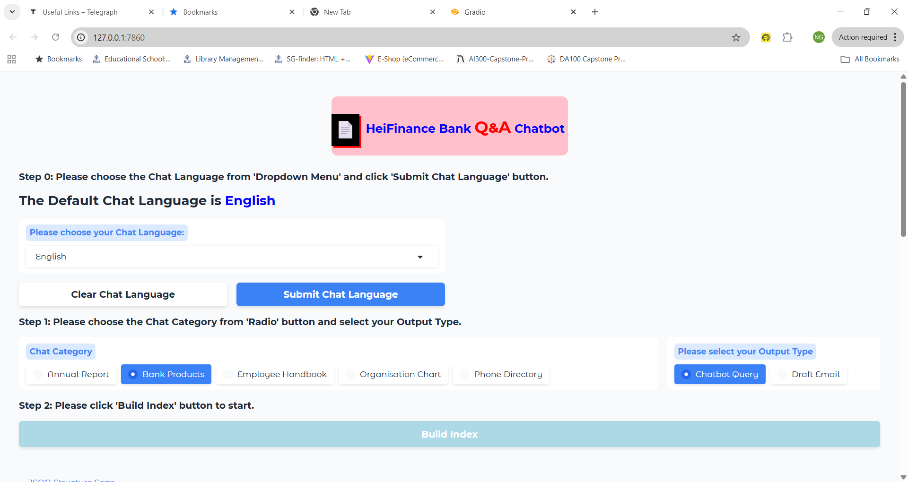
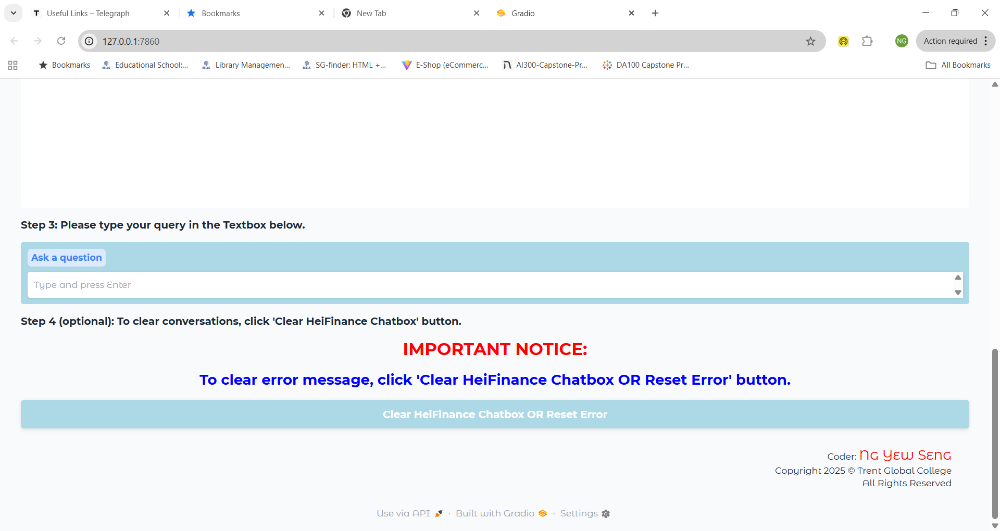

# TGC-CP1

## Codebase Author
**Ng Yew Seng**

<!-- .md means markdown -->

<!-- README.md -->
<!-- This file documents the information about the portfolio project. -->
<!-- It should be READ ME first!!! -->

---

## Live Web Application "HeiFinance Bank Q&A Chatbot"
**Website URL:**\
[**HeiFinance Bank:** Generative AI Tool](https://dc87f379f32f1bfecb.gradio.live)

Click the hyperlink <https://dc87f379f32f1bfecb.gradio.live> to start the live web application!

This share link expires in 1 week (dated 25 November 2025). For free permanent hosting and GPU upgrades, run `gradio deploy` from the terminal in the working directory to deploy to Hugging Face Spaces (https://huggingface.co/spaces)

---

<!-- Heading level 1 -->
# Trent Global College
**Problem Solving for IT Professionals (with Generative AI)**

FREE Course: **Python + AI**

By the end of the free course, the learner should be able to build a conversational chatbot that utilize Google's Gemini Language Model (LLM) and Gradio for an interactive user interface.

***Capstone Project Assignment - Portfolio***

The project consists of the following key components:

Part 1:\
**Environment Setup**: Using environment variables to securely store sensitive information like API Keys.

Part 2:\
**Integrating Gemini LLM**: Leveraging Google's Gemini LLM to generate inteligent responses.

Part 3:\
**Gradio Interface**: Creating an intuitive user interface for interacting with the chatbot.

Part 4:\
**Specialization**: Training the LLM, ensuring the chatbot sticls to its domain expertise.


<!-- Heading level 3 -->
### Project File Structure:

**TGC-CP1 Directory (Sources Root)**
```bash
TGC-CP1/   # Project Root
│── doc/
│   ├── Problem Solving for IT Professionals PP.docx.pdf  # Assessment 
│── img/
│   ├── heifinance-home-pg1.png  # 
│   ├── heifinance-home-pg2.png  #
│   ├── heifinance-home-pg3.png  # 
│   ├── heifinance-step0.png  #
│   ├── heifinance-step1-chat-query.png  # 
│   ├── heifinance-step1-draft-email.png  #
│   ├── heifinance-step2.png  # 
│   ├── heifinance-step3-chat-query.png  #
│   ├── heifinance-step3-draft-email.png  # 
│   ├── heifinance-step3.png  # 
│   ├── heifinance-step4.png  #
│   ├── TG-LOGO-COLOR.png  # Trent Global logo (png format)
│   ├── TG-LOGO-COLOR.webp  # Trent Global logo (webp format -> original) 
│── res/
│   ├── TG-LOGO-COLOR.ico  # Trent Global logo (ico format) 
│── pdf-HeiFinance/
│   ├── Annual Report/
│   │   ├── HeiFinance_Annual_Report_2025.pdf  # Pdf format for annual report
│   ├── Bank Products/
│   │   ├── HeiFinance Bank Product Fact Sheet.pdf  # Pdf format for bank products
│   ├── Employee Handbook/
│   │   ├── HeiFinance_Employee_Handbook.pdf  # Pdf format for employee handbook
│   ├── Organisation Chart/
│   │   ├── HeiFinance_Organization_Chart_Executive_Summary.pdf  # Pdf format for organization chart (new)
│   ├── Phone Directory/
│   │   ├── HeiFinance_Full_Directory_Complete.pdf  # Pdf format for phone directory
│   │   ├── heifinance_tables-formatted.json  # In-used json format for phone dircetory
│   │   ├── hei_tables-formatted copy.json  # Copy of hei_tables.json but formatted
│── src/
│   ├── app.py  # Gradio App for HeiFinance Q&A Chatbot
│   ├── gemini_utils.py  # Gemini AI model helper functions
│── .gitignore  # Ignore for Git push
│── .env  # Environment variables for the project
├── extract_tables_robust.py  # Document Converter from PDF to JSON format
├── hei_tables.json  # Converted JSON file format (from HeiFinance_Full_Directory_Complete.pdf)
│── requirements.txt  # Dependencies for the project
│── instructions.md # Setup instructions
│── README.md  # Documentation for Capstone Project
│── run-gradio.sh  # Bash file to run the Gradio app
│── run-venv.sh  # Bash file to run virtual environment
│── setup-environment.sh  # Bash file for environment setup
```

<!-- Heading level 1 -->
# Project Guide
For the purpose of the portfolio project, a frontend Gradio application with Generative AI model is created for the following:

```json
{
1. "HeiFinance Generative AI Tool" : in our case "HeiFinance Bank Q&A Chatbot"
}
```

This project is about a simple *Generative AI Tool* at **HeiFinance Bank** using the concepts we learned in the Python + AI course as part of the module Problem Solving for IT Professionals (with Generative AI) for SCTP BELLS FSD - Run 8 Cohort (Part-Time).


This simple web software is a chatbot specializing in answering questions related to the HeiFinance documents (currently implemented for Annual Report, Bank Products, Employee Handbook, Organisation Chart, and Phone Directory) and gracefully declines queries outside this domain.

It provides components using Gradio interface for user inputs using chatbot queries in order to obtain answers using simple RAG system for selecting a PDF file format document and an pre-defined JSON file format. It begins with 5-steps process as follows:

**Step 0:** Please choose the Chat Language from 'Dropdown Menu' and click 'Submit Chat Language' button.

**Step 1:** Please choose the Chat Category from 'Radio' button and select your Output Type.

**Step 2:** Please click 'Build Index' button to start.

**Step 3:** Please type your query in the Textbox below.

**Step 4 (optional):** To clear conversations, click 'Clear HeiFinance Chatbox' button.

<h1 style='text-align: center; color: red; !important'>IMPORTANT NOTICE:</h1> <h2 style='text-align: center; color: blue; !important'>To clear error message, click 'Clear HeiFinance Chatbox OR Reset Error' button.</h2>



Screenshot of Home Page (1 of 3)


Screenshot of Home Page (2 of 3)



Screenshot of Home Page (3 of 3)

")

Screenshot of Chat Language section (Step 0)

")

Screenshot of Chat Category + Chat Query section (Step 1a)

")

Screenshot of Chat Category + Draft Email section (Step 1b)

")

Screenshot of Build Index section (Step 2)

")

Screenshot of HeiFinance Chatbox + Chat Query section (Step 3a)

")

Screenshot of HeiFinance Chatbox + Draft Email section (Step 3b)

")

Screenshot of Chatbox section (Step 4)


Screenshot of About Page


<!-- Heading level 4 -->
#### The url for the portfolio project is here:

It is not deployed.

<!-- Heading level 4 -->
#### The source codes is hosted as public on a GitHub repository and the link is as follows: 

- [Source Codes GitHub Link](https://github.com/ngys9919/tgc-cp1 "My source-codes!")
: Click the hyperlink <https://github.com/ngys9919/tgc-cp1>

<!-- Heading level 2 -->
## 💻 Running via localhost using [GitHub Code Repository][1]
If using Windows OS for local running via GitHub, follow these steps:

### **Clone GitHub Repository**

```bash
git clone https://github.com/ngys9919/tgc-cp1.git
cd TGC-CP1
```

### **Setup Virtual Environment**

```bash
C:\\ProgramData\\anaconda3\\python.exe -m venv venv
# On Windows (using Git Bash Terminal):
source venv/Scripts/activate
# On Windows (using Command Prompt): venv\Scripts\activate
# On MacOS and Linux: source venv/bin/activate
```

### **Install Project Dependencies**

```bash
pip install -r requirements.txt
```

### **Run Gradio Application**

```bash
python src/app.py
```

### **Open Web Browser**

Open your web browser, enter the following URL:
 
**http://127.0.0.1:7860**

to start the Gradio web app!

<!-- Heading level 2 -->
## Features
The Python Web Framework used is Gradio (light-weight, popular for Generative AI aplications) and the Gemini Models adopted for PDF RAG (because we need vector embedding and general generative ai models) are:

**EMBED_MODEL** = *"text-embedding-004"*

**GEN_MODEL** = *"gemini-2.5-flash-lite"*

and the Gemini Model adopted for JSON (because we need code execution capability for data analysis using Python and Pandas library) is:

**GEN_MODEL2** = *"gemini-2.5-flash"*

<!-- Heading level 3 -->
### Existing Features


<!-- Heading level 3 -->
### Future Implementation


<!-- Heading level 2 -->
## Testing
 

### Testing A: using api_query_prediction.ipynb


### Testing B: using api-test.py


<!-- Heading level 2 -->
## Credits

### resource
- The .ico file used for this website was converted from .png logo file with this site:

  https://www.freeconvert.com/png-to-ico

- The special font used in this site was obtained from:

  https://fonts.google.com/

### Acknowledgements
Thanks to Trent Global College for support!

<!-- Heading level 2 -->
## About
> This project work, part of **Problem Solving for IT Professionals (with Generative AI)**, 
> is an individual cpastone project done by Candidate’s Name (as in NRIC): **Ng Yew Seng** (Candidate’s NRIC: **S XXXX 3 5 3 / F**), 
> a trainee under the **Python + AI** course, organized by **Trent Global College**. 

>>
>> Coder: ***Ng Yew Seng***\
>> © Copyright 2025\
>> Trent Global College


<!-- Heading level 2 -->
## Technologies Used
- [x] HTML5
- [x] CSS3
- [x] Python for programming
- [x] Gemini AI Studio
- [x] Gradio Framework for Web / API


<!-- Heading level 2 -->
## References
1.  [Microsoft Visual Studio Code](https://code.visualstudio.com) - Your code editor

2.  [Microsoft GitHub](https://www.github.com) - Your source codes repositories

3.  [Gemini AI Studio](https://aistudio.google.com/) - Gemini AI Models/API

4.  [Gradio](https://www.gradio.app/) - Gradio, a lightweight and powerful Python web framework

5.  [Trent Global College](https://trentglobal.edu.sg/)

6.  [Bells Institute of Higher Learning](https://bells.sg) 

<!-- hyperlinks -->
[1]: https://github.com "GitHub"